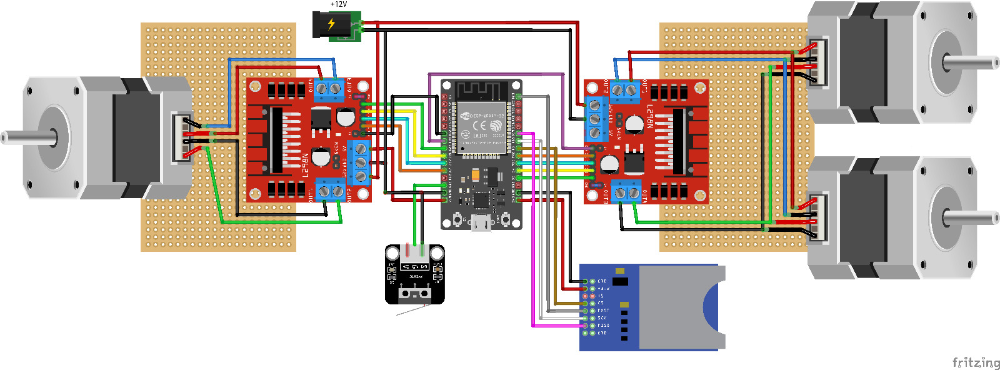
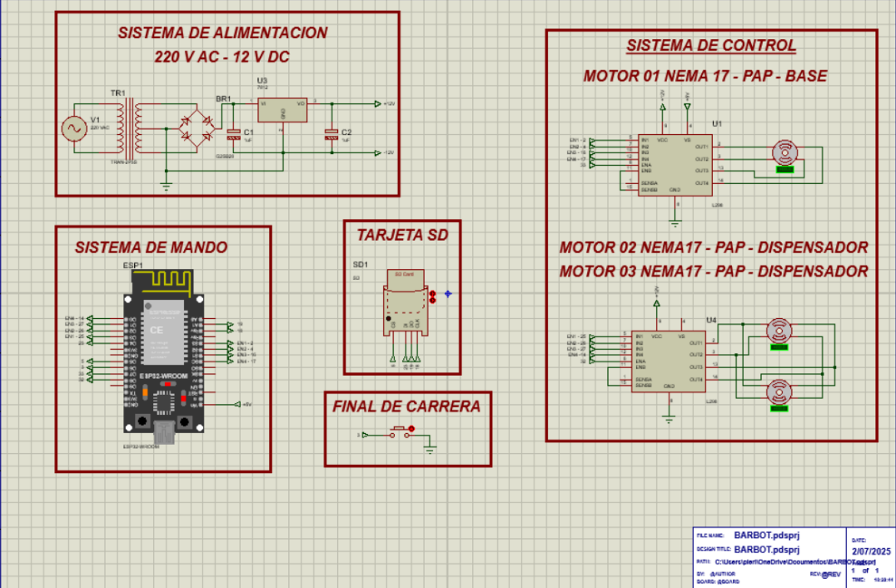
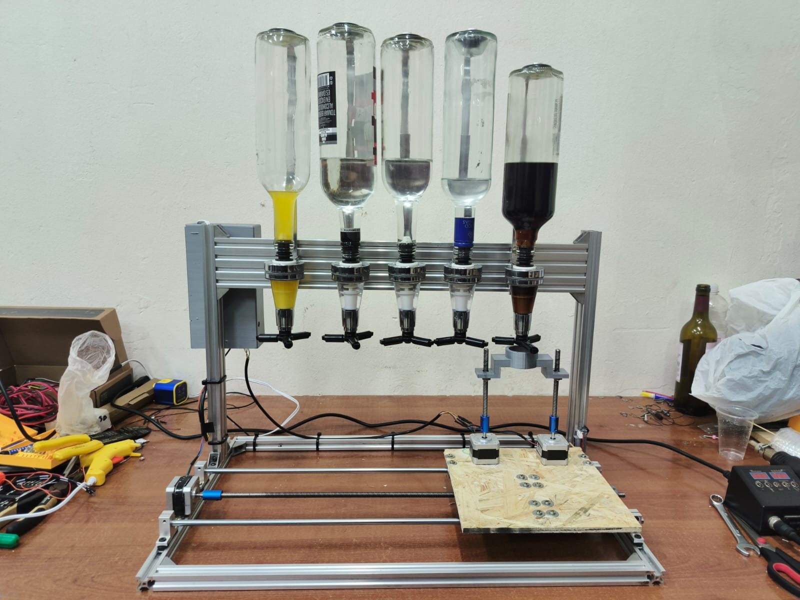
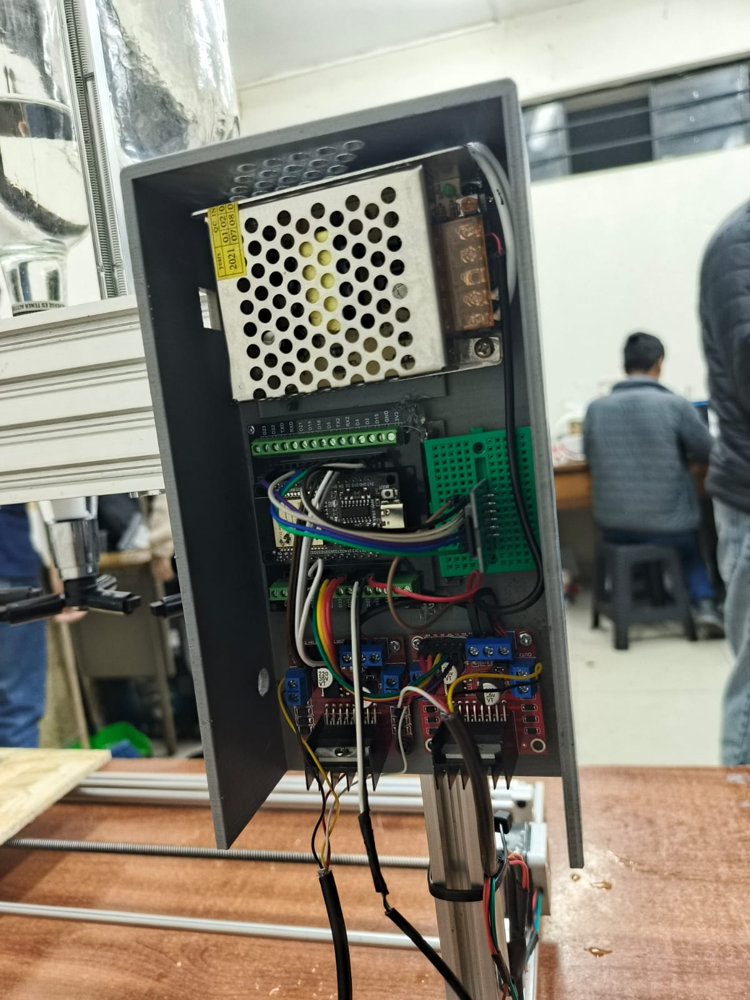

# Barbot ESP32

Barbot es un dispensador de bebidas automatizado basado en ESP32. Mueve una base circular entre varios dispensadores, lee recetas desde una tarjeta SD y expone un panel web en español para elegir bebidas desde el navegador.

## Características

- Configuración WiFi con portal cautivo vía WiFiManager (botón de reset durante el arranque).
- Servidor web con UI en español y mDNS en `http://barbot.local`.
- Máquina de estados que gestiona homing, movimiento entre dispensadores y servido.
- Recetas en `recipes.json` (formato simple con `disp` y `oz`).
- Control de motores paso a paso (Arduino `Stepper`) para base y dispensador.
- Consola serie para ejecutar recetas manualmente cuando el sistema está en reposo.

## Demo rápida

1) Enciende la placa con SD insertada. 2) Conecta a WiFi guardada o portal `BarBot_Config`. 3) Abre `http://barbot.local` y elige una receta.

## Requisitos

- Placa `esp32doit-devkit-v1`
- PlatformIO (VSCode o CLI)
- Tarjeta SD con `recipes.json`
- Fuente 12V 4A (sugerida)

## Comandos

- Compilar: `platformio run`
- Subir firmware: `platformio run --target upload`
- Monitor serie: `platformio device monitor --baud 115200`
- Pruebas: `platformio test -e esp32doit-devkit-v1`
- Limpiar: `platformio run --target clean`

## Estructura

- `src/main.cpp`: servidor HTTP y máquina de estados principal.
- `src/motor_control.cpp`: homing, movimientos y servido.
- `src/recipe_handler.cpp`: lógica de ejecución de recetas.
- `include/*.h`: pines/config, estados y recursos web.
- `recipes.json`: catálogo de recetas que muestra la UI.

## Hardware y cableado

- 3× NEMA 17 0.4A (1 para la base, 2 en paralelo para el dispensador)
- 2× L298N (1 para la base, 1 para los 2 motores del dispensador en paralelo)
- 1× Endstop NC/NO
- 1× Lector SD (SPI)
- 12V 4A (motores) y 5V de la placa (lógica) — comparte GND

Mapeo de pines (ver `include/config.h`):

- SD CS: `SD_CS_PIN 5` (SPI por defecto para SCK/MOSI/MISO)
- Endstop: `ENDSTOP_PIN 13` (INPUT_PULLUP, activo en LOW)
- Botón reset WiFi: `RESET_BUTTON_PIN 0` (IO0/BOOT)
- L298N Base (Driver #1): `BASE_PIN_1 25`, `BASE_PIN_2 26`, `BASE_PIN_3 27`, `BASE_PIN_4 14`, `BASE_ENABLE_PIN 32`
- L298N Dispensador (Driver #2): `SERVE_PIN_1 2`, `SERVE_PIN_2 4`, `SERVE_PIN_3 16`, `SERVE_PIN_4 17`, `SERVE_ENABLE_PIN 33`

Parámetros: `STEPS_PER_REVOLUTION 200`, `TOTAL_VUELTAS 45`, `TOTAL_DISPENSADORES 5`.

Notas sobre motores en paralelo (dispensador):

- Cablea ambos NEMA con las mismas fases en paralelo para que giren igual.
- La corriente por fase se suma (~0.8 A/fase si cada motor es 0.4 A); el L298N suele soportar 2 A pico por canal con buen disipador. Vigila temperatura.
- Si giran al revés, invierte el orden de fases en uno de los motores.

<div align="center">
  <table>
    <tr>
      <td align="center"><b>Esquema eléctrico</b></td>
      <td align="center"><b>Esquema electrónico</b></td>
    </tr>
    <tr>
      <td></td>
      <td></td>
    </tr>
  </table>
</div>

## Recetas (recipes.json)

Ejemplo:

```json
{
  "VodkaCola": [
    { "disp": 2, "oz": 1 },
    { "disp": 1, "oz": 2 }
  ]
}
```

- `disp`: índice de dispensador (1..TOTAL_DISPENSADORES)
- `oz`: onzas a servir por paso.

Dispensadores (1..5) sugeridos:

1. Cola
2. Vodka
3. Tónica
4. Ron
5. Naranja

Notas:

- `disp` debe estar en `1..TOTAL_DISPENSADORES`.
- En este proyecto, 1 “oz” en firmware equivale a ~1.5 oz reales (dispensadores de botella). Ajusta cantidades o calibra según tu hardware.

## Flujo de operación

1. Homing de la base al encender (endstop).
2. Carga de recetas desde SD (`/recipes.json`).
3. Conexión WiFi (o portal cautivo si se mantiene presionado el botón BOOT al inicio).
4. UI web: mDNS `http://barbot.local` funciona mejor en iOS. En Android/Windows, usa la IP mostrada por serie.
5. Estado final: vuelve al dispensador 1 y deshabilita motores.

## Calibración rápida

- Homing: el eje base se mueve en negativo hasta accionar el endstop (LOW) y fija el dispensador 1.
- Pasos por dispensador: el firmware calcula la separación en pasos con `TOTAL_VUELTAS` y `TOTAL_DISPENSADORES`. Ajusta `TOTAL_VUELTAS` para alinear todas las posiciones.
- Volumen: `serveOz(n)` realiza ciclos de avance/retroceso. Si 1 “oz” entrega ~1.5 oz, ajusta tus recetas o la lógica/retardos según tu bomba.

## Consejos de desarrollo

- Estilo: 2 espacios, llaves en misma línea; cadenas de UI en español.
- Evita asignación dinámica en rutas críticas; reutiliza buffers si es posible.

## Seguridad y notas

- No hardcodees credenciales: el portal de WiFiManager gestiona la configuración.
- Valida ingredientes y volúmenes en `recipes.json` antes de uso.
- 12V pueden dañar la lógica si conectas mal; comparte GND y separa retornos de motor.
- Ten cuidado con líquidos y electricidad: protege controladores y asegura ventilación.

## Imágenes

Fotos actuales del proyecto (ver carpeta `images/`):





Sugerencias: exporta a 1600–2400 px de ancho y comprime (JPG/PNG) para mantener el repo liviano.

## Licencia

MIT — ver `LICENSE` para los términos completos.

## Créditos

- Basado en ESP32 + Arduino, con `ArduinoJson`, `Stepper` y `WiFiManager`.
